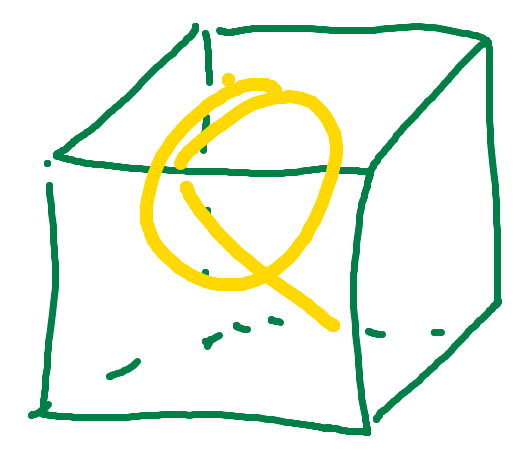

</img>

# ProjQUBE_alpha is a collection of extensions to ProjectQ

It was developed by Daniel Herr and includes:
* Clifford circuit simulator
* Engine for gate permutations through the circuit
* Exporter into OpenSurgery instructions

The original repository (QC_benchmark) included ProjectQ code. This repository separated the extensions from ProjectQ, reorganised the code into packages and, where needed, extended it.

The namespace projqube is organised similarly to the projectq namespace from the original codebase.
For example, if the OpenSurgery exporter is needed, then ``projqube.projectq.cengines`` is the package for the ``OpenSurgeryExporter``

More documentation: TODO